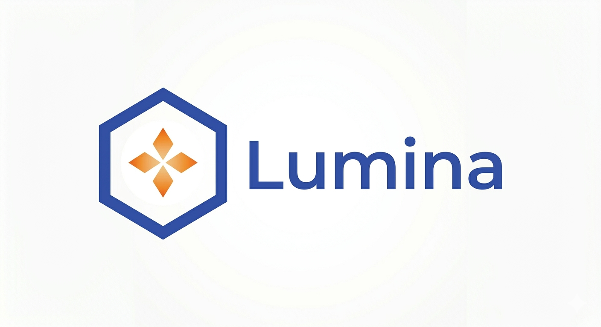

# Lumina — AI Study Suite powered by Gemma 4

> **5 AI-powered study tools in one app — learning roadmap, flashcards, Socratic debate arena, adaptive exam & AI whiteboard — running on Gemma 4 31B via cloud or fully local Ollama inference.**

Built for the **Gemma 4 Good Hackathon · Future of Education track** · May 2026

---

## What is Lumina?

Students don't struggle from a lack of information — they struggle from a lack of *structured, interactive, personalised* learning. Lumina gives every learner five deeply integrated Gemma 4-powered tools in one place, covering every stage of the learning loop: **plan → study → challenge → examine → explore**.

---

## Demo

> 📹 **[Watch the demo video →](https://youtu.be/DoKOSnYhl8w)**

---

## Features

### 🗺️ Learning GPS
Type any learning goal and get a structured week-by-week roadmap with daily focus areas, milestones, curated free resources, and self-check questions — all generated in real time by Gemma 4. One click from any week card launches that week's topic directly into Flash & Quiz, the Debate Arena, or The Examiner.

### ⚡ Flash & Quiz
Generate spaced-repetition flashcards from a topic description **or from photos of your handwritten notes** (Gemma 4's vision reads the images). Study with 3-D flip cards, then switch to quiz mode — write your answers and get instant AI feedback. Supports 5–20 cards per session.

### ⚖️ AgentDebate — Socratic Debate Arena
Enter any topic and three specialised Gemma 4 agents debate it live via real-time streaming:
- 🔍 **Critical Challenger** — attacks the mainstream position and exposes blind spots
- 🔭 **Consensus Builder** — synthesises truth by acknowledging every side
- 📚 **Fact-Checker** — grounds every claim in real Wikipedia articles fetched at session start

You can **interrupt the agents mid-debate** with a voice or typed message, directing your challenge at one agent or all three. After the final round, Gemma 4 synthesises the full transcript into a structured essay outline that you can download as a formatted `.docx` file.

### 🎓 The Examiner
An adaptive oral exam powered by Gemma 4. Answer questions by:
- **Voice** — speak your answer; the browser's Web Speech API transcribes it locally, no audio leaves your device
- **Typing** — classic text input with Ctrl+Enter to submit
- **Photo** — photograph your handwritten answer; Gemma 4 reads the handwriting via vision

The difficulty adapts in real time — harder questions when you score high, probing follow-ups when you miss. Every session ends with a graded report: overall score out of the full mark, grade (A–F), strengths, areas to improve, and study recommendations.

### 🎨 AI Whiteboard
A full **Excalidraw** canvas with a Gemma 4 chat panel on the side. Draw diagrams, sketch equations, write notes — then **snapshot the board** and ask Gemma anything about it. Gemma 4's vision capability reads and explains whatever is on your canvas. The chat history persists across the session for multi-turn dialogue about your work. The chat panel sits on the right in English and left in Arabic (full RTL support).

### 🗒️ Notes Panel
Save any output — roadmap weeks, flashcard sets, exam reports, whiteboard answers — to a persistent in-session notes panel. Download everything as a plain text file.

### 🖥️ Local Inference via Ollama
Run every AI feature entirely on your own machine — no API key, no cloud, no data leaves your device.

A **☁️ Cloud / 🖥️ Local** toggle sits in the top bar of the app. Switching to Local routes all requests through a local [Ollama](https://ollama.com) instance instead of Google AI Studio.

**Important — Debate Arena in local mode:** Because a single Ollama process can only run one request efficiently at a time, the three debate agents (Critical Challenger, Consensus Builder, Fact-Checker) run **sequentially** in local mode instead of in parallel. A status banner appears in the arena to let you know. All other features (GPS, Flash & Quiz, Examiner, Whiteboard) behave identically in both modes.

When you switch to Local the first time, a modal explains these details before anything changes.

### 📚 Session History
Every completed session is automatically saved to your browser's local storage (IndexedDB via Dexie.js) — nothing is sent to any server.

- **Auto-saved** after: a GPS roadmap is generated, flashcards are generated, an exam report is completed, each AI reply in the Whiteboard, and a Debate synthesis is produced.
- **History panel** — click the **History** button in the sidebar to open a slide-in panel listing all past sessions, sorted newest-first, grouped by feature with colour-coded icons and relative timestamps.
- **Restore any session** — click a history entry to jump straight back to that feature with your previous results loaded (roadmap, cards, exam report, whiteboard chat, or debate synthesis).
- **Delete** individual sessions with the hover delete button, or **Clear all** from the panel footer.

---

## Tech Stack

| Layer | Technology | Notes |
|---|---|---|
| LLM (cloud) | **Gemma 4 31B IT** (`gemma-4-31b-it`) | Via Google AI Studio API |
| LLM (local) | **Gemma 4 via Ollama** | Fully on-device, no API key needed |
| Backend | Node.js 18 + Express | REST + SSE |
| Frontend | React 18 + Vite + Tailwind CSS | |
| Canvas | **Excalidraw** | Full drawing/diagramming canvas |
| Real-time | **Server-Sent Events (SSE)** | Live token streaming for the debate |
| Knowledge / RAG | **Wikipedia REST API** | No key required — free & open |
| Speech input | **Web Speech API** | Browser-native, runs entirely on-device |
| Session storage | **Dexie.js** (IndexedDB) | Local persistent session history |
| Export | `docx` npm package | Essay outline → formatted Word file |
| Languages | English · Español · العربية | Full RTL support for Arabic |

---

## How each technology is used

### Gemma 4 31B (`gemma-4-31b-it`)
Every AI feature calls the same model through the `@google/generative-ai` SDK:

- **JSON mode** (`responseMimeType: 'application/json'`) forces structured output for roadmaps, flashcards, exam questions, and grading reports — no fragile regex parsing needed.
- **System instructions** separate the output schema from the user data prompt, preventing the model from echoing the schema instead of filling it in.
- **Vision** is used in Flash & Quiz (read handwritten note images → flashcards), The Examiner (read handwritten answer photos → grade them), and AI Whiteboard (read whiteboard snapshots → explain/analyse).
- **Multi-turn conversation** is used in The Examiner (adaptive questioning over a full exam session) and AI Whiteboard (persistent chat about the canvas).
- **Streaming** (`generateContentStream`) powers live token-by-token output in the debate arena. A non-streaming fallback kicks in automatically if the stream fails.
- **Retry logic** with a flat 2-second backoff handles transient 500 errors across all features.

### Local Inference via Ollama
When the user switches to **Local** mode, all backend routes call the [Ollama native chat API](https://ollama.com) (`POST http://localhost:11434/api/chat`) instead of Google AI Studio. The backend service (`backend/services/ollama.js`) mirrors every function signature from the cloud services so the rest of the backend code doesn't change — just the routing.

- **Structured JSON** is requested using Ollama's `format: "json"` option, with a robust fallback parser that extracts arrays or objects from any wrapper shape the model might return.
- **Streaming** uses Ollama's NDJSON stream format for live debate token delivery.
- **Vision** is supported for models with vision weights (handwriting transcription and whiteboard snapshots).
- **Sequential debate**: Ollama runs one inference at a time efficiently, so debate agents run one after another. The server sends a `local_sequential` SSE event to show a notice in the UI.

### Wikipedia REST API
Used as the knowledge base for the Fact-Checker debate agent. When a debate session starts, the backend calls `en.wikipedia.org/w/api.php` to search for the top 5 Wikipedia articles related to the topic, then fetches the intro extract (up to 1,500 chars) of the top 3 results. These extracts are injected into the Fact-Checker's system prompt as grounded sources. No API key required.

### Excalidraw
The AI Whiteboard feature embeds the full Excalidraw React component as a drawing canvas. When the user clicks **Snapshot**, the app uses Excalidraw's `exportToBlob` utility to render the current canvas to a PNG, converts it to base64, and sends it to Gemma 4 alongside the user's chat message for vision-based analysis.

### Web Speech API (browser-native speech recognition)
Speech input is processed **entirely in the browser** — no audio is sent to any server. Used in The Examiner (speak answers), AgentDebate (voice interrupts), and AI Whiteboard (voice chat input). The recognition language matches the app's selected language (`en-US`, `es-ES`, or `ar-SA`).

> **Note:** Web Speech API requires Chrome or Edge. Firefox is not supported by this API.

### Dexie.js (IndexedDB session history)
Session data is stored locally in the browser using [Dexie.js](https://dexie.org), a lightweight IndexedDB wrapper. Each saved session stores: type (gps / quiz / exam / debate / whiteboard), a human-readable title, the full session data payload, and a timestamp. No data is sent to any server — everything stays on the user's device. Sessions persist across page refreshes and browser restarts until the user deletes them.

---

## Prerequisites

- **Node.js v18 or later** — [download](https://nodejs.org/)
- **A free Google AI Studio API key** — [get one here](https://aistudio.google.com/apikey) *(only needed for cloud mode)*
- **Chrome or Edge** for voice input features (other browsers work for everything else)
- **Git** — [download](https://git-scm.com/)

**For local inference (optional):**
- **Ollama** — [download from ollama.com](https://ollama.com)
- The **Gemma 4** model pulled in Ollama (see local setup below)

---

## Local Setup

### 1. Clone the repository

```bash
git clone https://github.com/zeyadAlmothafar-founder/Lumina.git
cd Lumina
```

### 2. Set up the backend

```bash
cd backend
npm install
```

Copy the example environment file:

```bash
# Mac / Linux
cp .env.example .env

# Windows
copy .env.example .env
```

Open `backend/.env` and paste your API key:

```env
GOOGLE_AI_KEY=your_google_ai_studio_key_here
GEMMA_MODEL=gemma-4-31b-it
PORT=3001

# Local inference (optional — only needed if you use the Local toggle)
OLLAMA_BASE_URL=http://localhost:11434
OLLAMA_MODEL_LOCAL=gemma4:e4b
```

Start the backend:

```bash
node server.js
# → Lumina backend running on http://localhost:3001
```

### 3. Set up the frontend

Open a **new terminal** in the project root:

```bash
cd frontend
npm install
npm run dev
# → App running on http://localhost:5173
```

### 4. Open the app

Go to **[http://localhost:5173](http://localhost:5173)**.

> The Vite dev server automatically proxies all `/api/*` requests to the backend on port 3001 — no extra configuration needed.

---

## Setting Up Local Inference (Ollama)

To use the **🖥️ Local** toggle in the app, you need Ollama running with a Gemma 4 model.

### Step 1 — Install Ollama

Download and install from **[ollama.com](https://ollama.com)**. After installation, Ollama starts automatically on `http://localhost:11434`. You can verify it's running by opening that URL in your browser — it should say **"Ollama is running"**.

### Step 2 — Pull the Gemma 4 model

```bash
ollama pull gemma4:e4b
```

This downloads the model (several GB — size depends on the variant). Wait for it to finish before switching the toggle.

To see which models you have available:

```bash
ollama list
```

Copy the exact model name from the `NAME` column (e.g., `gemma4:e4b`) and set it in `backend/.env`:

```env
OLLAMA_MODEL_LOCAL=gemma4:e4b
```

Replace `gemma4` with the exact name shown by `ollama list` if different.

### Step 3 — Restart the backend and switch the toggle

Restart the backend (`node server.js`) so it picks up the `.env` change, then click the **🖥️ Local** button in the top-right of the app. A confirmation modal explains what changes in local mode. Click **Use Local Ollama** to confirm.

> **All requests now go to your local machine.** No data is sent to Google. The toggle shows **🖥️ Local** in blue when active. Switch back to **☁️ Cloud** at any time.

---

## Using Session History

Every time you complete a session in any feature, Lumina saves it automatically to your browser's local storage. Nothing is uploaded anywhere.

**To browse your history:**
1. Click **History** in the left sidebar
2. A panel slides in from the right showing all saved sessions, newest first
3. Each entry shows the feature icon, session title, and how long ago it was saved

**To restore a session:**
- Click any entry — Lumina navigates to that feature and loads your previous results (roadmap, flashcards, exam report, whiteboard chat, or debate synthesis)

**To delete sessions:**
- Hover over a session and click the 🗑 icon to delete just that one
- Click **Clear all sessions** at the bottom of the panel to wipe the full history

**What triggers an auto-save:**

| Feature | Saves when… |
|---|---|
| Learning GPS | A roadmap is generated |
| Flash & Quiz | Flashcards are generated |
| The Examiner | The final exam report is produced |
| AI Whiteboard | After each AI reply (updates in place) |
| AgentDebate | After the debate synthesis is generated |

---

## Project Structure

```
lumina/
├── backend/
│   ├── server.js                  # Express app — all API routes + SSE stream
│   ├── services/
│   │   ├── tools.js               # Gemma 4 cloud: GPS, Quiz, Examiner, Whiteboard
│   │   ├── gemma.js               # Gemma 4 cloud: streaming debate agents + synthesis
│   │   ├── ollama.js              # Ollama local: mirrors all tools.js + gemma.js functions
│   │   ├── wikipedia.js           # Wikipedia REST API — search + extract (RAG)
│   │   └── docx.js                # Essay outline → .docx export
│   ├── .env.example
│   └── package.json
├── frontend/
│   ├── src/
│   │   ├── App.jsx                # Root — routing, inference toggle, history loading
│   │   ├── db.js                  # Dexie.js schema + session CRUD helpers
│   │   ├── i18n.js                # All UI strings (EN / ES / AR)
│   │   ├── context/
│   │   │   └── InferenceContext.jsx  # React context for cloud/local mode
│   │   └── components/
│   │       ├── Sidebar.jsx
│   │       ├── HistoryPanel.jsx   # Slide-in session history browser
│   │       ├── Landing.jsx        # Debate topic input + agent preview
│   │       ├── DebateArena.jsx    # Live 3-agent debate (SSE consumer)
│   │       ├── SynthesisScreen.jsx
│   │       ├── LearningGPS.jsx
│   │       ├── FlashQuiz.jsx
│   │       ├── TheExaminer.jsx
│   │       ├── AIWhiteboard.jsx   # Excalidraw + Gemma 4 vision chat
│   │       ├── MicButton.jsx      # Web Speech API voice input
│   │       └── NotesPanel.jsx
│   ├── vite.config.js
│   └── package.json
└── README.md
```

---
## License

This project is licensed under the **Creative Commons Attribution 4.0 International (CC-BY 4.0)** license, as required by the Gemma 4 Good Hackathon competition rules.

You are free to share and adapt this work for any purpose, including commercially, as long as you give appropriate credit.

**[View the full license →](https://creativecommons.org/licenses/by/4.0/)**
